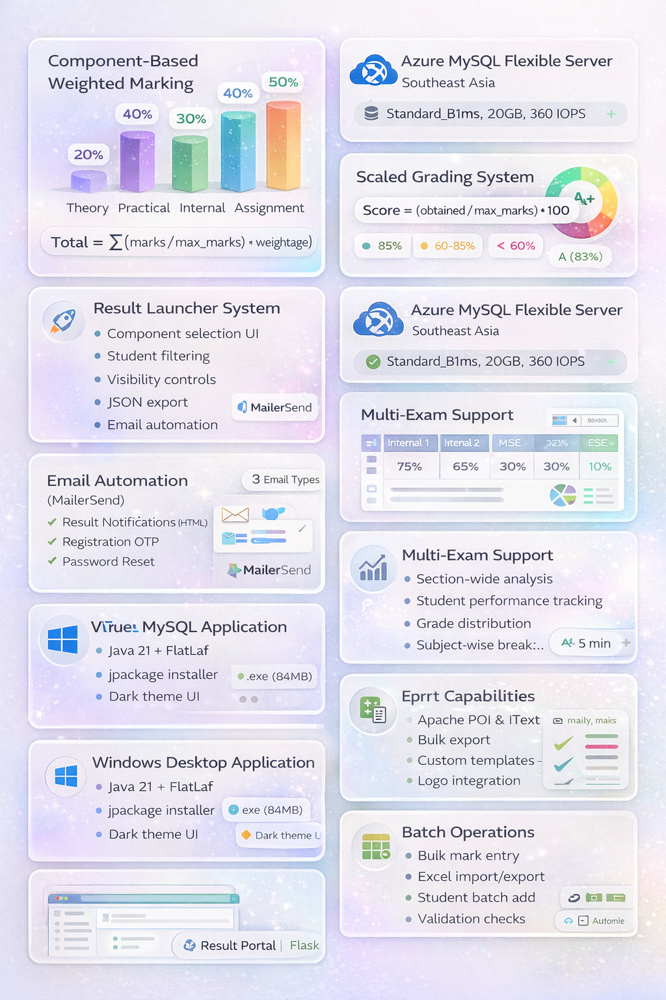
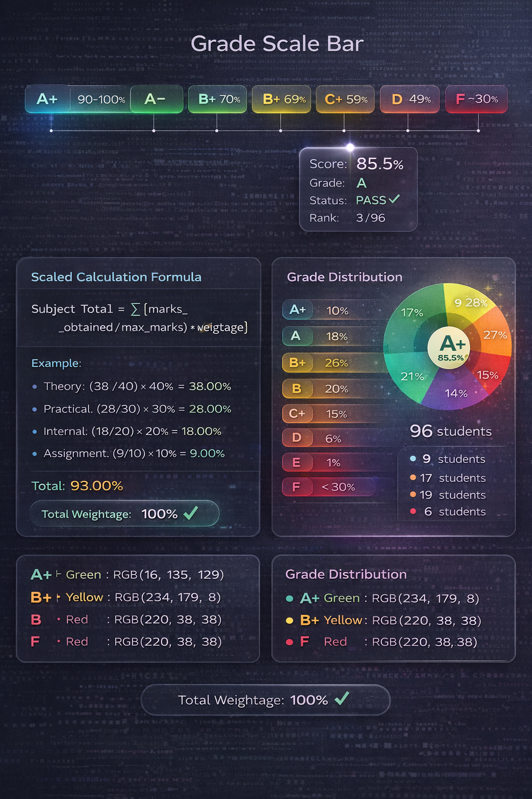
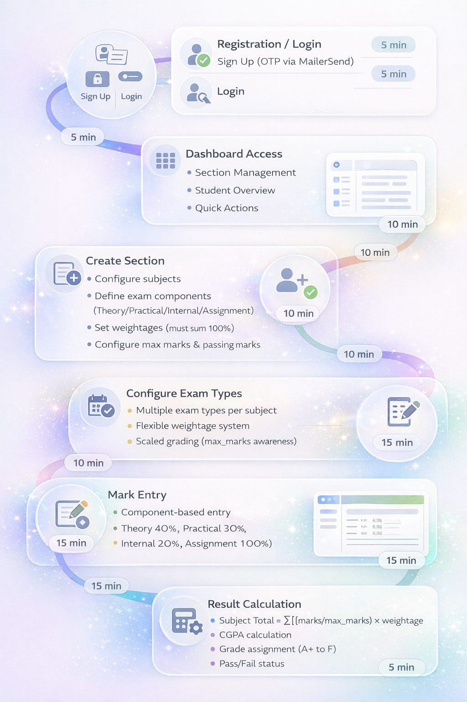
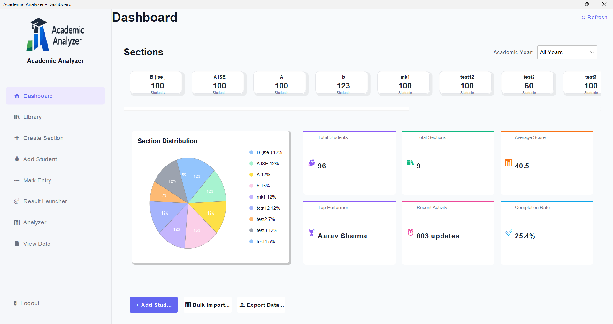
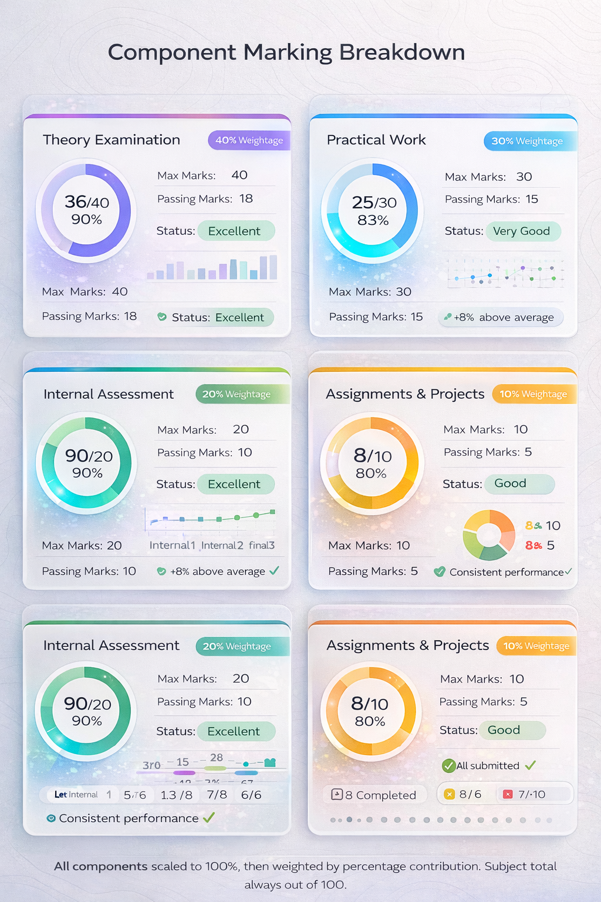

<div align="center">


# 🎓 Academic Analyzer

### Cloud-Native Academic Performance Management System

[](https://azure.microsoft.com/en-us/services/mysql/)
[](https://www.oracle.com/java/)
[](https://www.python.org/)
[](https://flask.palletsprojects.com/)
[](LICENSE)

[**🚀 Live Demo**](https://academicanalyzer-portal.azurewebsites.net/results) • [**📥 Download Desktop App**](../../releases) • [**📖 Documentation**](docs/INDEX.md) • [**🐛 Report Bug**](../../issues)

</div>

---

## 📋 Table of Contents

- [Overview](#-overview)
- [Video Demo](#-video-demo)
- [Key Features](#-key-features)
- [Architecture](#-architecture)
- [Technology Stack](#-technology-stack)
- [Screenshots](#-screenshots)
- [Getting Started](#-getting-started)
- [Installation](#-installation)
- [Usage Guide](#-usage-guide)
- [Database Schema](#-database-schema)
- [Deployment](#-deployment)
- [Documentation](#-documentation)
- [Contributing](#-contributing)
- [License](#-license)

---

## 🌟 Overview

**Academic Analyzer** is a comprehensive, cloud-native academic performance management system designed for educational institutions. Built with modern technologies and deployed on Azure cloud infrastructure, it provides a complete solution for managing students, sections, marking schemes, exam configurations, and result distribution.

### Why Academic Analyzer?

✅ **Cloud-Native Architecture** - Fully deployed on Azure with MySQL Flexible Server  
✅ **Component-Based Marking** - Flexible weighted grading system with custom weightages  
✅ **Scaled Calculations** - Automatic mark scaling with configurable max marks per component  
✅ **Multi-Exam Support** - Handle multiple exam types (Internal, MSE, ESE, Assignments)  
✅ **Result Launcher** - Selective result publishing with email automation  
✅ **Web Portal** - Students can view results online via responsive Flask web app  
✅ **Desktop Application** - Native Windows application with modern FlatLaf UI  
✅ **Email Automation** - Integrated MailerSend for notifications and OTP verification  
✅ **Export Capabilities** - PDF & Excel export with institutional branding  

---

## � Video Demo

<div align="center">

### 📹 Complete System Walkthrough

Watch the full demonstration of Academic Analyzer, covering all features from login to result portal deployment.

[](https://youtu.be/8Su_4x62NY0)

**[▶️ Watch on YouTube](https://youtu.be/8Su_4x62NY0)**

*Duration: ~12 minutes | Topics: Login, Dashboard, Student Management, Marks Entry, Analytics, Result Launcher, Portal*

</div>

---

## �🎯 Key Features



### 📚 Academic Management
- **Section Management** - Create and manage academic sections with custom configurations
- **Student Records** - Batch student entry with roll number validation
- **Subject Configuration** - Define subjects with credits, max marks, and passing criteria
- **Exam Types** - Configure multiple exam components with individual weightages

### 📊 Marking & Grading System



- **Component-Based Marking** - Theory, Practical, Internal, Assignments with custom weights
- **Scaled Grading Formula** - `Subject Total = Σ[(marks/max_marks) × weightage]`
- **Color-Coded Validation** - Real-time visual feedback (Red/White/Green)
- **Bulk Operations** - Import/Export marks via Excel templates
- **Auto-Calculation** - Instant weighted total computation

### 🚀 Result Launcher

- **Component Selection** - Choose specific exam components to include
- **Student Filtering** - Select individual students or entire sections
- **Visibility Control** - Configure what students can see (marks, rank, statistics)
- **Email Distribution** - Automated email delivery with professional templates
- **Result History** - Track all launched results with timestamps

### 📈 Analytics & Reports

- **Section Analysis** - Grade distribution, subject-wise performance
- **Student Performance** - Individual progress tracking with CGPA calculation
- **Grade Scaling** - A+ to F grade assignment based on percentage
- **Ranking System** - Automated student ranking with class statistics

### 🌐 Web Portal


**Live Portal:** [https://academicanalyzer-portal.azurewebsites.net/results](https://academicanalyzer-portal.azurewebsites.net/results)

- **Responsive Design** - Mobile-friendly interface
- **Secure Access** - Roll number verification
- **Result Viewing** - Clean, organized result display
- **PDF Download** - Download results as PDF

---

## 🏗️ Architecture


### System Components

**Desktop Application (Java Swing)**
- Modern FlatLaf dark theme UI
- Offline-capable with cloud sync
- Windows native installer (.exe)
- Resource-efficient (84MB package)

**Result Portal (Flask)**
- Python 3.11 web application
- Deployed on Azure App Service (Linux)
- MySQL connection with environment variables
- Professional email templates

**Cloud Infrastructure (Azure)**
- **Azure MySQL Flexible Server** - Southeast Asia region
- **Azure App Service** - Linux container (B1 tier)
- **MailerSend Integration** - Email automation service
- **Application Insights** - Monitoring and diagnostics

### User Flow



1. **Authentication** - Login/Register with OTP verification via MailerSend
2. **Section Creation** - Configure subjects and exam components
3. **Student Management** - Add students in batch mode
4. **Mark Entry** - Component-based mark entry with auto-scaling
5. **Result Calculation** - Weighted total computation with CGPA
6. **Result Launch** - Selective publishing with email distribution
7. **Portal Access** - Students view results online

---

## 💻 Technology Stack


### Desktop Application
| Technology | Version | Purpose |
|------------|---------|---------|
| **Java** | 21 | Core application language |
| **Swing** | Built-in | GUI framework |
| **FlatLaf** | 3.6 | Modern look and feel |
| **MySQL Connector** | 8.2.0 | Database connectivity |
| **iText PDF** | 5.5.13.3 | PDF generation |
| **Apache POI** | 5.2.3 | Excel import/export |
| **JFreeChart** | 1.5.4 | Data visualization |
| **jpackage** | Built-in | Native installer creation |

### Web Portal
| Technology | Version | Purpose |
|------------|---------|---------|
| **Python** | 3.11 | Backend language |
| **Flask** | 3.0 | Web framework |
| **mysql-connector-python** | Latest | Database driver |
| **ReportLab** | 4.0.7 | PDF generation |
| **Gunicorn** | Latest | Production WSGI server |

### Cloud & Services
| Service | Configuration | Purpose |
|---------|--------------|---------|
| **Azure MySQL Flexible Server** | Standard_B1ms, 20GB | Database hosting |
| **Azure App Service** | Linux, Python 3.11, B1 | Web app hosting |
| **MailerSend** | API integration | Email automation |
| **Azure Southeast Asia** | Primary region | Low latency for region |

---

## 📸 Screenshots

### Desktop Application


*Modern dashboard with glassmorphic design and real-time statistics*


*Component-based marking system with weighted calculations*

### Key Interfaces

**📊 Dashboard**
- Real-time student count and section statistics
- Recent activity feed
- Quick action buttons
- Grade distribution charts

**✏️ Mark Entry**
- Component-wise mark entry (Theory, Practical, Internal, Assignment)
- Auto-scaled calculation display
- Color-coded validation feedback
- Bulk import from Excel templates

**🚀 Result Launcher**
- Visual component selection cards
- Student filtering options
- Visibility configuration
- Email distribution with custom messages

**📈 Section Analyzer**
- Grade distribution visualization
- Subject-wise performance breakdown
- Top performers ranking
- Pass/fail statistics

---

## 🚀 Getting Started

### Prerequisites

**For Desktop Application:**
- Windows 10/11 (64-bit)
- No Java installation required (JRE bundled)
- 200 MB free disk space

**For Development:**
- JDK 21 or higher
- Maven 3.6+
- MySQL 8.0+ (or Azure MySQL)
- Python 3.11+ (for portal development)

### Quick Start

#### Option 1: Download Windows Installer (Recommended)

1. **Download** the latest release from [Releases](../../releases)
2. **Run** `AcademicAnalyzer-1.0.0.exe`
3. **Follow** installation wizard
4. **Launch** from Start Menu or Desktop shortcut

#### Option 2: Build from Source

```bash
# Clone repository
git clone https://github.com/yourusername/AcademicAnalyzer.git
cd AcademicAnalyzer

# Configure database
# Edit .env file with your Azure MySQL credentials

# Compile and build
javac -encoding UTF-8 -d bin -cp "lib/*" -sourcepath src src/Main.java

# Run directly
java -cp "bin;lib/*" Main

# Or build installer
./build-installer.ps1
```

---

## 📥 Installation

### Desktop Application Setup

1. **Download Installer**
   - Get `AcademicAnalyzer-1.0.0.exe` from [Releases](../../releases)
   - Size: ~149 MB (includes JRE)

2. **Install Application**
   - Double-click the installer
   - Choose installation directory
   - Create desktop shortcut (recommended)
   - Add to Start Menu

3. **First Launch**
   - Application will validate database connection
   - If `.env` is missing, configure database manually
   - Create an account or login

### Database Configuration

The application uses Azure MySQL Flexible Server by default. The `.env` file should be included with the installation, but you can create it manually:

```env
# Database Configuration
DB_HOST=academicanalyzer-db-sea.mysql.database.azure.com
DB_PORT=3306
DB_NAME=academic_analyzer
DB_USERNAME=your_username
DB_PASSWORD=your_password

# MailerSend Configuration
MAILERSEND_API_KEY=your_api_key
MAILERSEND_FROM_EMAIL=noreply@yourdomain.com
MAILERSEND_FROM_NAME=Academic Analyzer

# Portal Configuration
RESULT_PORTAL_URL=https://academicanalyzer-portal.azurewebsites.net
```

Place this file in the application installation directory.

---

## 📖 Usage Guide

### 1. Create Section

```
Dashboard → Add Section → Configure subjects and exam types
```

- Enter section name (e.g., "A ISE", "B CSE")
- Set academic year and semester
- Add subjects with credits
- Configure exam components:
  - **Theory** (40% weightage, 40 max marks)
  - **Practical** (30% weightage, 30 max marks)
  - **Internal** (20% weightage, 20 max marks)
  - **Assignment** (10% weightage, 10 max marks)
- Ensure weightages sum to 100%

### 2. Add Students

```
Dashboard → Add Student → Select section → Batch entry
```

- Select target section
- Enter student details (name, roll number)
- Email and phone are optional
- Add multiple students before saving
- Validate for duplicate roll numbers

### 3. Enter Marks

```
Dashboard → Mark Entry → Select section & subject
```

- Choose section and subject
- Enter marks for each component
- System auto-calculates weighted total
- Color indicators:
  - 🟢 **Green** - Above average
  - ⚪ **White** - Average
  - 🔴 **Red** - Below passing marks
- Export to Excel or import from template

### 4. Launch Results

```
Dashboard → Result Launcher → Configure & Launch
```

- Select exam components to include
- Choose target students
- Configure visibility:
  - ✅ Show component marks
  - ✅ Show subject details
  - ⬜ Show rank
  - ✅ Show class statistics
  - ✅ Allow PDF download
- Enter custom message (optional)
- Send emails automatically

### 5. View Results (Students)

**Web Portal:** [https://academicanalyzer-portal.azurewebsites.net/results](https://academicanalyzer-portal.azurewebsites.net/results)

- Enter roll number
- Select section
- View detailed results
- Download PDF copy

---

## 🗄️ Database Schema


### Core Tables (17 Total)

**Authentication**
- `users` - User accounts and credentials
- `registration_otps` - OTP verification for registration
- `password_reset_otps` - OTP for password reset

**Academic Structure**
- `sections` - Academic sections/classes
- `students` - Student records (182 records)
- `subjects` - Subject definitions (32 subjects)
- `section_subjects` - Section-subject mapping with marks config

**Exam Configuration**
- `exam_types` - Exam component definitions (66 types)
- `subject_exam_types` - Junction table for subject-exam mapping

**Marking System**
- `marking_schemes` - Marking scheme definitions
- `component_groups` - Component grouping logic
- `marking_components` - Individual components (89 components)

**Marks Storage**
- `marks` - Student marks (230 entries)
- `entered_exam_marks` - Component-wise marks (1443 entries)
- `student_component_marks` - Scaled marks calculation

**Result Management**
- `launched_results` - Published results (10 launches)
- `launched_student_results` - Individual result data (JSON)

### Key Relationships

- Students belong to Sections (1:N)
- Sections have Subjects (N:M via section_subjects)
- Subjects have Exam Types (N:M via subject_exam_types)
- Students have Marks per Subject per Exam Type
- Results are launched for specific Components and Students

**Full Schema:** See [schema_current_2026-01-18.sql](docs/database/schema_current_2026-01-18.sql)

---

## 🚀 Deployment


### Desktop Application Deployment

```bash
# Clean build
Remove-Item -Recurse -Force bin, dist

# Compile
javac -encoding UTF-8 -d bin -cp "lib/*" -sourcepath src src/Main.java

# Build installer
./build-installer.ps1

# Output: AcademicAnalyzer-1.0.0.exe (~149 MB)
```

### Web Portal Deployment (Azure)

```bash
cd result-portal

# Deploy to Azure App Service
az webapp up \
  --name academicanalyzer-portal \
  --resource-group AcademicAnalyzer-RG \
  --runtime "PYTHON:3.11" \
  --sku B1

# Configure environment variables
az webapp config appsettings set \
  --name academicanalyzer-portal \
  --resource-group AcademicAnalyzer-RG \
  --settings \
    DB_HOST="academicanalyzer-db-sea.mysql.database.azure.com" \
    DB_NAME="academic_analyzer" \
    DB_USERNAME="your_username" \
    DB_PASSWORD="your_password"
```

### Azure MySQL Setup

```bash
# Create MySQL Flexible Server
az mysql flexible-server create \
  --name academicanalyzer-db-sea \
  --resource-group AcademicAnalyzer-RG \
  --location southeastasia \
  --sku-name Standard_B1ms \
  --tier Burstable \
  --storage-size 20 \
  --version 8.0.21

# Import database
mysql -h academicanalyzer-db-sea.mysql.database.azure.com \
  -u admin_user \
  academic_analyzer < docs/database/schema_current_2026-01-18.sql
```

---

## 📚 Documentation

Comprehensive documentation is available in the `/docs` folder:

### User Guides
- [**Exam Types Configuration**](docs/guides/EXAM_TYPES_DISTRIBUTION_GUIDE.md) - Complete guide for exam setup
- [**Marks Calculation**](docs/guides/MARKS_CALCULATION_GUIDE.md) - Detailed calculation formulas
- [**Documentation Validation**](docs/guides/DOCUMENTATION_VALIDATION_SUMMARY.md) - Feature verification

### Technical Documentation
- [**Architecture**](docs/CODEBASE_ARCHITECTURE.md) - Complete system architecture
- [**Database Schema**](docs/DATABASE_SCHEMA_ANALYSIS.md) - Database design and relationships
- [**Email System**](docs/EMAIL_SYSTEM_UPGRADE.md) - Email integration details
- [**Azure Migration**](docs/AZURE_DATABASE_MIGRATION.md) - Cloud deployment guide

### Component Docs
- [Add Student](docs/project/ADD_STUDENT_TECHNICAL_DOC.md)
- [Create Section](docs/project/CREATE_SECTION_TECHNICAL_DOC.md)
- [Mark Entry](docs/project/MARK_ENTRY_TECHNICAL_DOC.md)
- [Result Launcher](docs/project/RESULT_LAUNCHER_TECHNICAL_DOC.md)
- [Section Analyzer](docs/project/SECTION_ANALYZER_TECHNICAL_DOC.md)
- [Student Analyzer](docs/project/STUDENT_ANALYZER_TECHNICAL_DOC.md)
- [View Tool](docs/project/VIEW_TOOL_TECHNICAL_DOC.md)

### Quick Links
- [Index](docs/INDEX.md) - Documentation overview
- [Setup Guide](docs/SETUP.md) - Installation instructions
- [Requirements](docs/REQUIREMENTS.md) - System requirements

---

## 🛠️ Development

### Project Structure

```
AcademicAnalyzer/
├── src/                          # Java source code
│   ├── Main.java                # Application entry point
│   └── com/sms/
│       ├── analyzer/            # Performance analysis
│       ├── dashboard/           # Main UI
│       ├── dao/                 # Data access layer
│       ├── database/            # DB connection
│       ├── login/               # Authentication
│       ├── marking/             # Marking system
│       ├── resultlauncher/      # Result publishing
│       ├── util/                # Utilities
│       └── viewtool/            # View & export
├── resources/                   # Images and assets
├── lib/                         # JAR dependencies
├── docs/                        # Documentation
├── result-portal/               # Flask web app
│   ├── app.py                  # Flask application
│   ├── templates/              # HTML templates
│   └── static/                 # CSS, JS, images
├── build-installer.ps1         # Windows installer builder
└── .env                        # Configuration (not in repo)
```

### Build Commands

```bash
# Compile only
javac -encoding UTF-8 -d bin -cp "lib/*" -sourcepath src src/Main.java

# Run application
java -cp "bin;lib/*" Main

# Build installer
./build-installer.ps1

# Run Flask portal locally
cd result-portal
python app.py
```

### Environment Variables

Required in `.env` file:

```env
DB_HOST=your_database_host
DB_PORT=3306
DB_NAME=academic_analyzer
DB_USERNAME=your_username
DB_PASSWORD=your_password
MAILERSEND_API_KEY=your_mailersend_key
MAILERSEND_FROM_EMAIL=noreply@yourdomain.com
RESULT_PORTAL_URL=your_portal_url
```

---

## 🤝 Contributing

Contributions are welcome! Please follow these guidelines:

1. **Fork** the repository
2. **Create** a feature branch (`git checkout -b feature/AmazingFeature`)
3. **Commit** your changes (`git commit -m 'Add some AmazingFeature'`)
4. **Push** to the branch (`git push origin feature/AmazingFeature`)
5. **Open** a Pull Request

### Development Guidelines

- Follow Java code conventions
- Add JavaDoc comments for public methods
- Test thoroughly before submitting
- Update documentation for new features
- Ensure backward compatibility

---

## 🐛 Bug Reports & Feature Requests

Found a bug or have a feature request?

- **Bug Reports:** [Open an issue](../../issues/new?template=bug_report.md)
- **Feature Requests:** [Open an issue](../../issues/new?template=feature_request.md)

Please include:
- Detailed description
- Steps to reproduce (for bugs)
- Expected vs actual behavior
- Screenshots if applicable
- System information

---

## 📄 License

This project is licensed under the MIT License - see the [LICENSE](LICENSE) file for details.

---

## 👥 Authors

**Development Team**
- Lead Developer - System Architecture & Backend
- UI/UX Designer - Interface Design
- Database Administrator - Schema Design

---

## 🙏 Acknowledgments

- **FlatLaf** - Modern Swing look and feel
- **Azure** - Cloud infrastructure
- **MailerSend** - Email automation service
- **Apache POI** - Excel processing
- **iText** - PDF generation
- **JFreeChart** - Data visualization
- **Flask** - Python web framework

---

## 📞 Support

Need help? Reach out:

- 📧 Email: support@academicanalyzer.com
- 🌐 Web Portal: [academicanalyzer-portal.azurewebsites.net](https://academicanalyzer-portal.azurewebsites.net/results)
- 📖 Documentation: [docs/INDEX.md](docs/INDEX.md)
- 💬 Issues: [GitHub Issues](../../issues)

---

## 📊 Project Stats


---

<div align="center">

### ⭐ Star this repository if you find it helpful!

**Made with ❤️ for Educational Institutions**

[Back to Top ↑](#-academic-analyzer)

</div>
